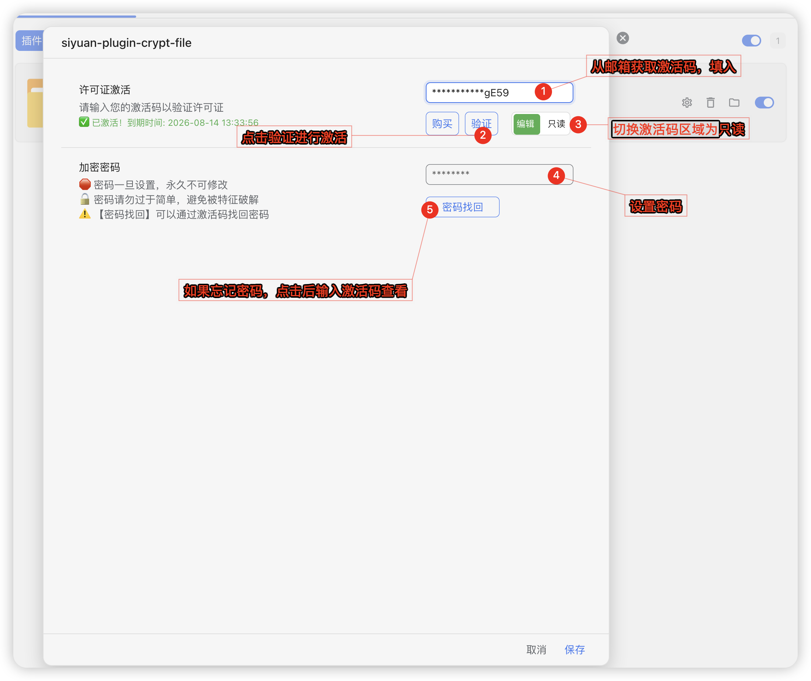
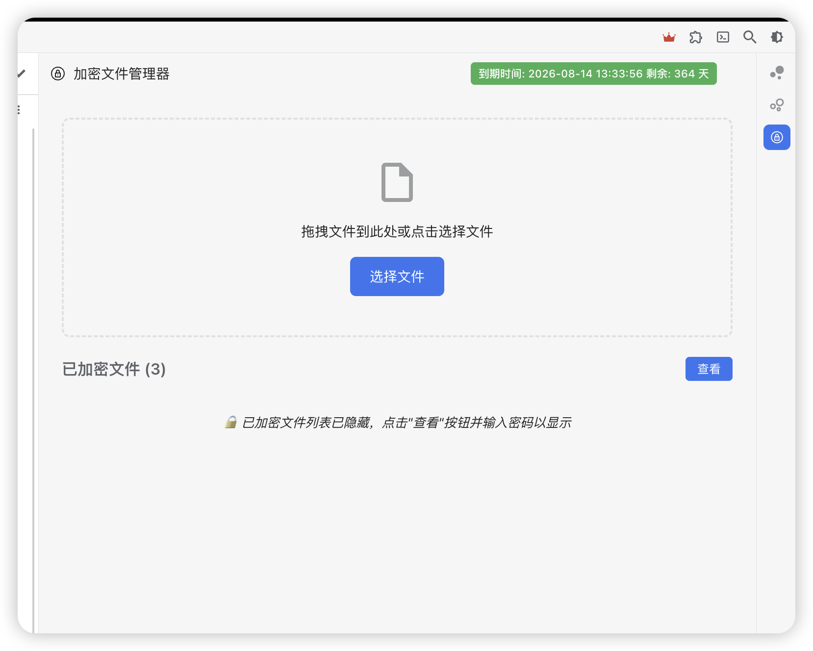
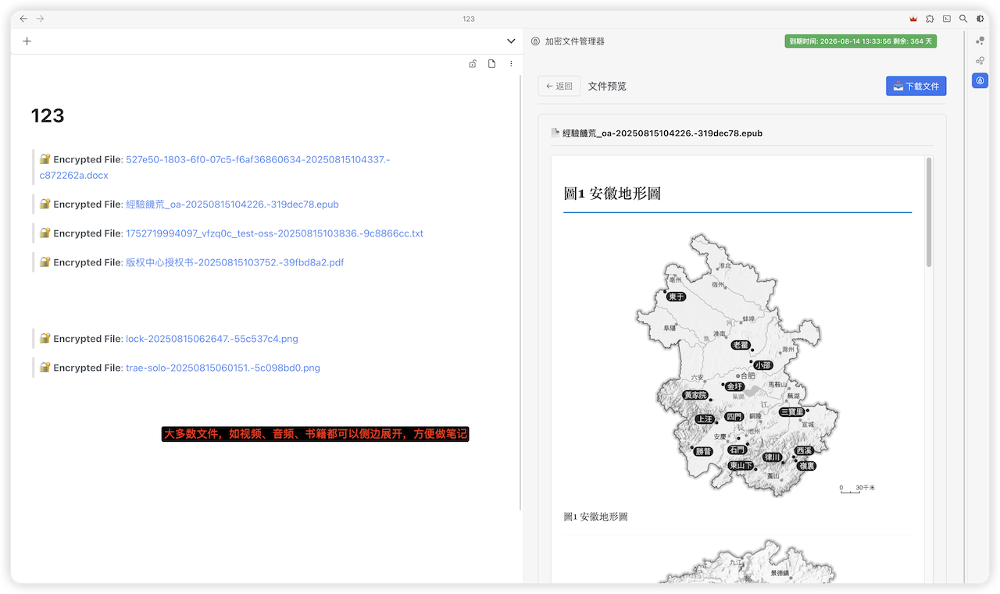
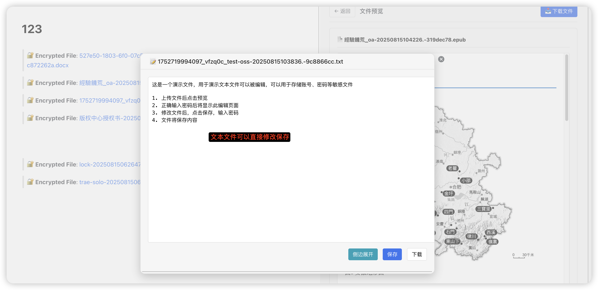
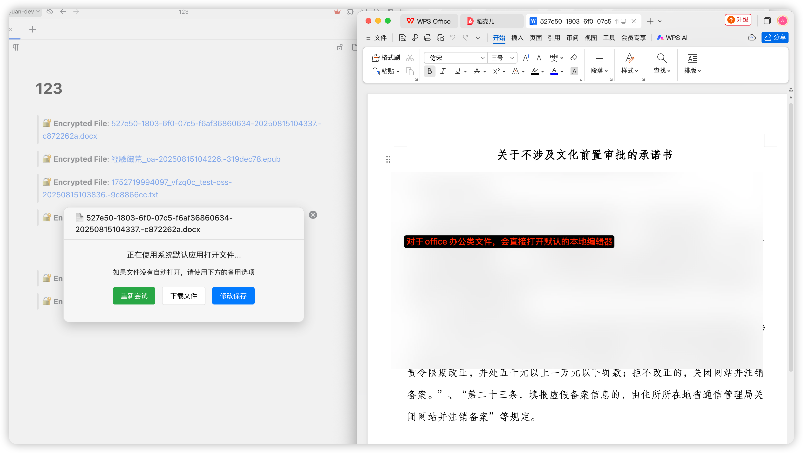

# 思源笔记加密文件管理器插件

[English](./README.md)

## 功能介绍

这是一个为思源笔记开发的加密文件管理器插件,提供文件的加密功能，和思源笔记可以完美契合。提供以下核心功能：

### 🔐 文件加密上传
- 支持上传文件加密
- 使用 AES-256-CBC 加密算法确保文件安全
- 自动生成带时间戳和UUID的唯一文件名

### 📁 文件管理界面
- 直观的加密文件列表展示
- 显示文件图标、原始名称、存储名称和文件大小
- 支持文件预览、插入和删除操作
- 支持思源笔记的链接和锚文本属性

## 使用方法

1. **插件配置**
   1. 前往[炬熵小店](https://shop.hugeshop.cyou),购买激活码
   2. 配置里面填入激活码,并激活
   3. 可选：建议在激活后将激活码输入设置为只读，避免被重置激活码导致密码被查看
   4. 设置密码并保存。 ⚠️ **重要提示：密码一旦设置后不可修改，否则之前加密的文件将无法解密！**

  

2. **插件使用**

  - 图片讲解

  
  
  
  
  

- 视频教程
<iframe src="//player.bilibili.com/player.html?isOutside=true&aid=115052912902459&bvid=BV1qBYazpEUg&cid=31790926826&p=1" scrolling="no" border="0" frameborder="no" framespacing="0" allowfullscreen="true"></iframe>

## 文件类型支持

插件支持多种文件类型，并会根据文件扩展名自动识别图标：

- 📄 文档文件：.txt, .md, .doc, .docx, .pdf
- 🖼️ 图片文件：.jpg, .jpeg, .png, .gif, .bmp, .svg
- 🎵 音频文件：.mp3, .wav, .flac, .aac
- 🎬 视频文件：.mp4, .avi, .mkv, .mov
- 📊 表格文件：.xls, .xlsx, .csv
- 💻 代码文件：.js, .ts, .py, .java, .cpp, .html, .css

其中：☝️ 文本文件可以在线编辑，建议用来存储敏感信息

## 安装方法

### 从集市安装（推荐）
1. 打开思源笔记
2. 进入集市 → 插件
3. 搜索"加密文件管理器"
4. 点击安装

### 手动安装
1. 从 [Releases](https://github.com/your-username/siyuan-plugin-crypt-file/releases) 下载最新版本的 `package.zip`
2. 解压到思源笔记的 `data/plugins/` 目录
3. 重启思源笔记

## 常见问题

### Q: 忘记密码怎么办？
A: 通过输入激活码来查看密码

### Q: 可以修改密码吗？
A: 不可以。密码一旦设置后不能修改，这是为了保护已加密文件的安全性,避免出现密码错乱问题。

### Q: 文件存储在哪里？
A: 加密文件存储在思源笔记的 `data/crypt/` 目录下：
- `temp/`: 临时文件（上传后未插入笔记的文件）
- `crypted/`: 正式文件（已插入笔记的文件）

### Q: 支持哪些文件类型？
A: 理论上支持所有文件类型，常见的包括：
- 文档：PDF、Word、Excel、PowerPoint、文本文件
- 图片：JPG、PNG、GIF、SVG、WebP
- 音视频：MP3、MP4、AVI、MOV
- 压缩包：ZIP、RAR、7Z
- 其他：任意格式的文件

## 现存问题
- [] 已加密文件如果对应记录被删除，会弹出tree not found警告 
- [] 点击[侧边展开]的时候，如果侧边栏已经打开，会自动关闭，需要重新打开

## 更新日志

### v1.0.0
- 初始版本发布
- 实现基础的文件加密上传功能
- 提供文件管理界面
- 支持文件插入到笔记功能
- 实现密码保护机制，密码设置后不可修改

## 支持

如果这个插件对您有帮助，欢迎：
- ⭐ 给项目点个星
- 🐛 报告问题或建议
- 💡 提交功能请求
- 📢 推荐给其他用户

## 贡献

欢迎提交 Issue 和 Pull Request！

---

**免责声明**：本插件仅供学习和个人使用，请确保遵守相关法律法规。作者不对因使用本插件造成的任何损失承担责任。
